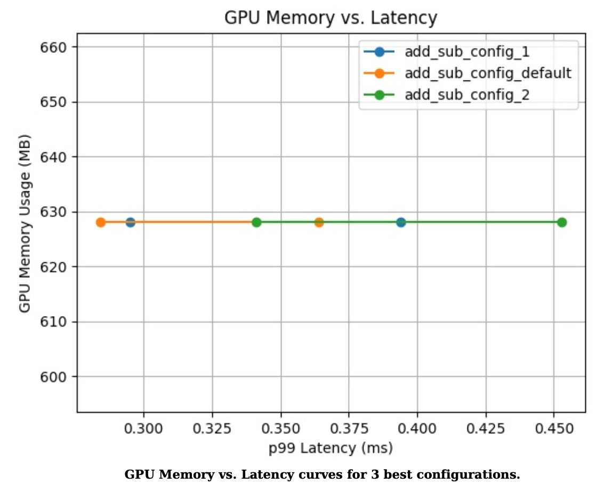

# 3.1 서비스 메쉬

쿠버네티스를 통해 MicroService Architecture 를 보통 구현 하게 됩니다. 이러한 시스템은 기존 Monolitihic Architecture의 단점은 극복하고 작은 서비스들로 하나의 서비스를 이루는 것은 각각의 서비스를 독릭접으로 관리할 수 있다는 유연하게 운용할 수 있지만 거대해진 MSA 시스템을 보면 수십개의 마이크로서비스가 분리되어 있고, 운영환경에는 수천개의 서비스 인스턴스가 동작하게 됩니다.

물론 서비스 관리자는 수백\~수천개의 인스턴스들을 관리하고, 모니터링하며, 로깅해야 하는 책임이 주어지게 됩니다.

이로 인해 서비스간의 통신도 매우 복잡해 질수 밖에 없습니다.&#x20;

이와 같은 관리 및 프로그래밍 오버헤드를 낮추기 위해 나온 아키텍처가 바로 서비스 메시 입니다.

### 서비스 메시

&#x20;기존의 서비스 아키텍처에서의 호출은 직접호출 하지만 서비스 메쉬에서의 호출은 서비스에 딸린 proxy끼리 호출하게 됩니다.

// 그림 필요

이는 서비스의 트래픽을 네트워크단에서 통제할 수 있게 하고, 또한 Client의 요구에 따라 proxy단에서 라우팅서비스도 가능하게 할 수 있습니다.

이런 다양한 기능을 수행하려면 기존 TCP기반의 proxy로는 한계가 있습니다.

그래서 서비스 메쉬에서의 통신은 사이드카로 배치된 **경량화되고 L7계층기반의 proxy** 를 사용하게 됩니다.

프록시를 사용해서 트래픽을 통제할 수 있다는 것 까지는 좋은데, **서비스가 거대해짐에 따라 프록시 수도 증가**하게 됩니다.

이런 문제를 해결하기 위해서 각 프록시에 대한 설정정보를 **중앙집중화된 컨트롤러**가 통제할 수 있게 설계되었습니다.

// 그림 필요 Data Plane, Control plane

프록시들로 이루어져 트래을 설정값에 따라 컨트롤 하는 부분을 Data plane 이라 하고, 프록시들의 설정 값을 전달 하고 관리 하는 컨트롤러 역할을 Control Plane 이라고 합니다.

&#x20;서비스 메쉬의 구현체들은 위와 같이 많이 존재하지만 쿠버네티스상에서 가장 활발하게 사용 되고 있는 **ISTIO** 에 대해서 설명 하도록 하겠습니다.




